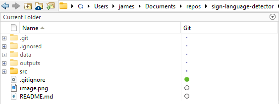

# MATLAB Setup
1. Ensure you open the root repository in MATLAB so it looks like this: 
(This is so that data gathered will go to the correct location!)

2. Select the `src` folder and right click. Add selected folder and sub folders to path.

## src Directory

- **asl_app/**: Main app. Runs the webcam-based ASL sign language detector using a trained network.
- **data_collector/**: Captures still images from a webcam for building training datasets.
- **data_video_collector/**: Records video of sign language with per-letter timestamps for dataset creation.
- **data_tester/**: Evaluates a trained model against test images/video and shows accuracy, precision, recall, F1, and confusion matrices.
- **model_trainer/**: Training scripts for different architectures (ResNet-18/50/101, GoogLeNet).
- **python/**: Utility script to split dataset images into training and test sets.